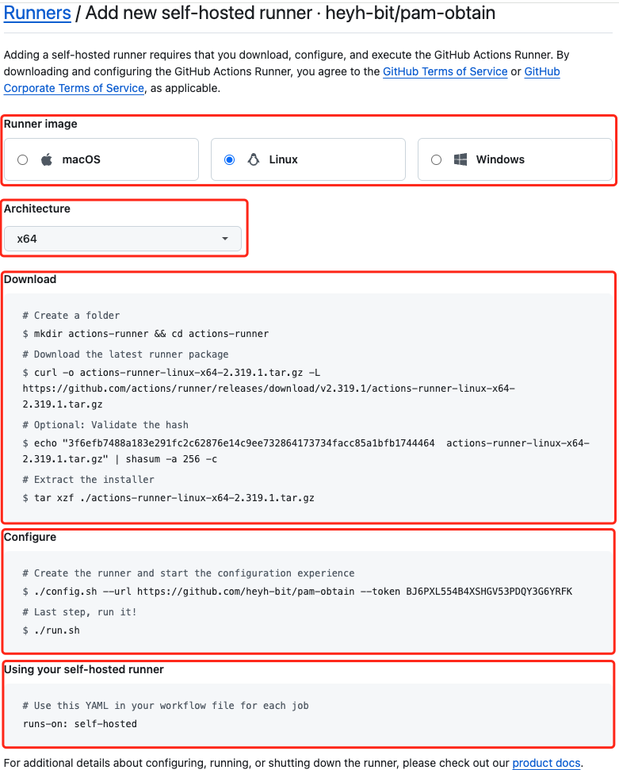
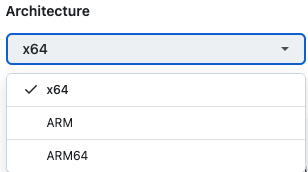
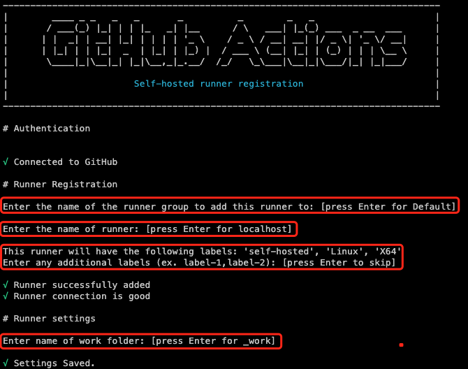
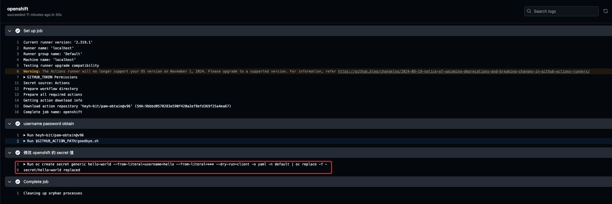
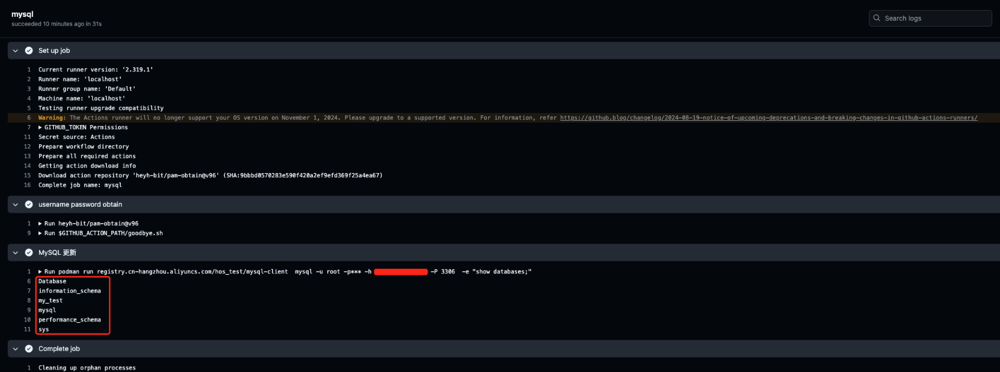

# PAM Obtain

pam-obtain 是由 GitHub Action 功能编写获取 PAM 托管资产中密码的功能插件, Action 通过 Appmgr 向 PAM 获取密码;

## 准备开始

- Docker | Podman 及访问 DockerHub 环境;
- GitHub 及访问 GitHub 环境;
- 一台 Linux | Windows | MacOS 主机, 用于搭建 GitHub Actions Runners (Github 自托管运行器) 环境;
-  GitHub Actions Runners (Github 自托管运行器) 环境主机可与 GitHub Actions 通信;

## 术语和缩略语

GitHub Actions是一个持续集成和持续交付(CI/CD)平台，允许您自动构建、测试和部署管道；

**workflow** （工作流）：持续集成一次运行的过程，就是一个 workflow；这是一组自动化任务的过程，可以在GitHub存储库中触发和运行，允许开发人员根据需求定义代码的自动化流程；

**Events**：事件是指GitHub存储库中发生的特定活动，如推送代码、创建拉取请求等。这些事件可以作为工作流程的触发器，当事件发生时，相应的工作流程将被触发执行；

**Jobs** （任务集）：一个 workflow 由一个 Jobs 构成，含义是一次持续集成的运行，可以完成一个 Jobs；

**Job**（任务）：一个 Jobs 由许多 Job 构成，含义是一次持续集成的运行，可以完成一系列的 Job；

**Action**：动作是执行特定任务的脚本或命令，可以是单个任务或一组任务的集合，用于在工作流程中执行特定的操作，如构建、测试、部署等；

**Runners**：运行器是用于执行工作流中任务的虚拟环境或物理机器；GitHub提供了托管的运行器，也支持自托管的运行器，开发人员可以根据需要选择合适的运行器来执行他们的工作流；

## 搭建 Docker

[Linux 环境 安装 Docker - 点我传送](https://www.cnblogs.com/HOsystem/p/14487084.html)

## 搭建 GitHub Actions Runners

### Actions Runners 使用所需步骤

Github Actions Runners 搭建所需步骤，分为以下几步：

- 选择 Runners 环境操作系统；
- 选择 Runners 环境 CPU 架构；
- 下载 actions-runner 安装包；
- 配置主机和 GitHub 自托管运行器通信；
- 使用 GitHub 自托管运行器；



### 自托管运行器支持的操作系统

**自托管运行器应用程序支持以下操作系统：**

| 操作系统 | 版本信息                                                     |
| -------- | ------------------------------------------------------------ |
| Linux    | Red Hat Enterprise Linux 8 或更高版本<br />CentOS 8 或更高版本<br />Oracle Linux 8 或更高版本<br />Fedora 29 或更高版本<br />Debian 10 或更高版本<br />Ubuntu 20.04 或更高版本<br />Linux Mint 20 或更高版本<br />openSUSE 15.2 或更高版本<br />SUSE Enterprise Linux (SLES) 15 SP2 或更高版本 |
| Windows  | Windows 10 64 位 <br />Windows 11 64 位 <br />Windows Server 2016 64 位 <br />Windows Server 2019 64 位 <br />Windows Server 2022 64 位 |
| MacOS    | macOS 11.0 (Big Sur) 或更高版本                              |


### 自托管运行器支持的 CPU 架构

**自托管运行器应用程序支持以下处理器架构：**



### 下载 actions-runner 安装包

```sh
# 1. 创建目录
$ mkdir actions-runner && cd actions-runner 
# 2. 下载 actions-runner 安装包
$ curl -o actions-runner-linux-x64-2.319.1.tar.gz -L https://github.com/actions/runner/releases/download/v2.319.1/actions-runner-linux-x64-2.319.1.tar.gz
# 3. 验证 Hash 值, 这一步可省略 (验证安装包没有被篡改);
$ echo "3f6efb7488a183e291fc2c62876e14c9ee732864173734facc85a1bfb1744464  actions-runner-linux-x64-2.319.1.tar.gz" | shasum -a 256 -c# Extract the installer

# 4. 解压缩
$ tar xzf ./actions-runner-linux-x64-2.319.1.tar.gz
```

### 配置 GitHub 自托管运行器通信

- 安装 actions-runner 依赖

```sh
# 5. 安装依赖
$ ./bin/installdependencies.sh
```

- 配置主机和 GitHub 自托管通信

```sh
# RUNNER_ALLOW_RUNASROOT 设置为1, 否则会报错
$ RUNNER_ALLOW_RUNASROOT="1" ./config.sh --url https://github.com/heyh-bit/pam-obtain --token xxxxxxxx #添加成功后进入github页面查看该runner应是灰色offline状态

# 配置参数说明
## 设置添加runner到哪个runner group
## 设置runner名字
## 设置runner标签label
## 设置工作目录
```



- 运行 actions-runners 

```sh
# actions-runners 运行方式有两种, 任选其一:
## 一种是前台运行(不可关闭前台程序, 否则会断开连接, 一般用于测试), ./run.sh
## 一种是后台运行加入 systemd 中(推荐, 一般用于生产), ./svc.sh

## 方式一:
$ RUNNER_ALLOW_RUNASROOT="1" ./run.sh

## 方式二:
$ RUNNER_ALLOW_RUNASROOT="1" ./svc.sh install ## 以其他用户身份安装 systemd 服务则执行./svc.sh install USERNAME
$ RUNNER_ALLOW_RUNASROOT="1" sudo ./svc.sh start ## 启动systemd服务，进入github页面查看该runner应是绿色Idle状态
```

### 使用自托管的运行程序

```yaml
# 在 workflow 中 job 中使用
## 语法: runs-on: [标签], 单个标签时可省略[];
runs-on: self-hosted # runs-on: [self-hosted] 同等效果
```

## 使用 pam-obtain

### Example

```yaml
name: PAM Obtain Demo

on: # 触发时机
  push:
  issue_comment:
    types: [created, deleted]
  issues:
    types: [opened, edited, milestoned]

jobs:
  openshift_demo:
    runs-on: [self-hosted] # 自建环境
    name: openshift
    steps:
      - id: step1
      	name: Import pam-obtain using username password obtain Action
        # heyh-bit-pam-obtain@v52 
        uses: heyh-bit/pam-obtain@v96
        # pam-obtain Action Arguments
        with:
          app-id: "test"
          user-name: "root"
          asset-name: "resource"
          connect-host: "ip address"
          credential: ${{ secrets.PAM_TOKEN }}
```

### Arguments

- `app-id` - PAM 应用关联中 `应用ID`  值；
- `user-name` - PAM 托管资产中待查询账号；
- `asset-name` - PAM 托管资产名；
- `connect-host` - PAM IP 地址；
- `credential` - PAM 应用关联, 应用中 `认证信息` 证书 value 值；


## openshift Demo

### Example

```yaml
name: PAM Obtain Demo

on: # 触发时机
  push:
  issue_comment:
    types: [created, deleted]
  issues:
    types: [opened, edited, milestoned]

jobs:
  openshift_demo:
    runs-on: [self-hosted] # 自建环境
    name: openshift
    steps:
      # step1: 通过 Action, 使用 PAM 查询密码
      - id: step1
      	name: Import pam-obtain using username password obtain Action
        # heyh-bit/pam-obtain@v96
        uses: heyh-bit/pam-obtain@v96
        # pam-obtain Action Arguments
        with:
          app-id: "test"
          user-name: "root"
          asset-name: "resource"
          connect-host: "ip address"
          credential: ${{ secrets.PAM_TOKEN }}
      # step2: 通过 env.password 使用查询的密码
      - id: step2
        name: 修改 openshift 的 secret 值
        run: >
          oc create secret generic hello-world
          --from-literal=username=hello
          --from-literal=pwd=${{ env.password }}
          --dry-run=client -o yaml -n default | oc replace -f -
```

### run



## MySQL Demo

### Example

```yaml
name: PAM Obtain Demo

on: # 触发时机
  push:
  issue_comment:
    types: [created, deleted]
  issues:
    types: [opened, edited, milestoned]

jobs:
  mysql-update:
    runs-on: [self-hosted]
    name: mysql
    steps:
      # step1: 通过 Action, 使用 PAM 查询密码
      - id: step1
      - name: username password obtain
        uses: heyh-bit/pam-obtain@v96
        # pam-obtain Action Arguments
        with:
          app-id: "test"
          user-name: "root"
          asset-name: "resource"
          connect-host: "10.13.1.2"
          credential: ${{ secrets.PAM_TOKEN }}
      # step2: 通过 env.password 使用查询的密码
      - id: step2
        name: mysql update
        run: >
          podman run registry.cn-hangzhou.aliyuncs.com/hos_test/mysql-client 
          mysql -u root
          -p${{ env.password }}
          -h "8.221.143.170"
          -P 3306 
          -e "show databases;"
```

### run




## 参考文档

[添加自托管的运行器 - 点我传送](https://docs.github.com/zh/actions/hosting-your-own-runners/managing-self-hosted-runners/adding-self-hosted-runners)

[Linux 环境 安装 Docker - 点我传送](https://www.cnblogs.com/HOsystem/p/14487084.html)

## License

[MIT](https://github.com/heyh-bit/pam-obtain/blob/main/LICENSE)
